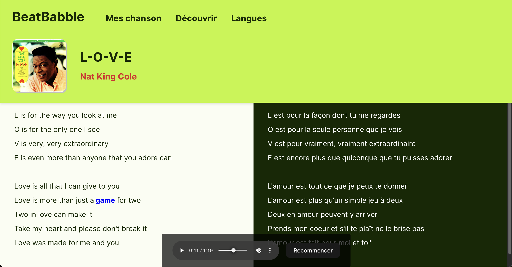

# BeatBabble

Learn language with music!

### Demo Video:

## Functionalities
- Click words to see their translation
- Play the song directly in your browser
- Synced lyrics during song playback

## Instructions
- The main screen code is in src/App.jsx

### Start the React frontend
- Navigate to the project directory ("BeatBabble") in your terminal
- Use command "npm install" to install dependancies
- Use command "npm run dev" to start the app
- It will give you a link similar to "http://localhost:5173/", enter this in your browser and you will see the project

### Start Node backend
- Open a new terminal window (leave the other one open)
- Navigate to the project directory ("BeatBabble") in your terminal
- Use command "node backend/server.js" to start the Node server
